<div align="center">

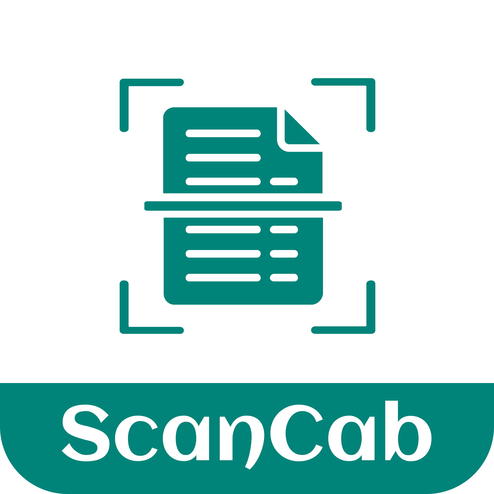

# ScanCab: All Documents Scanner

**Turn your phone into a smart pocket scanner. Scan, edit, extract text, and share PDFs in seconds.**

[](https://play.google.com/store/apps/details?id=com.scan.scancab&pcampaignid=web_share)


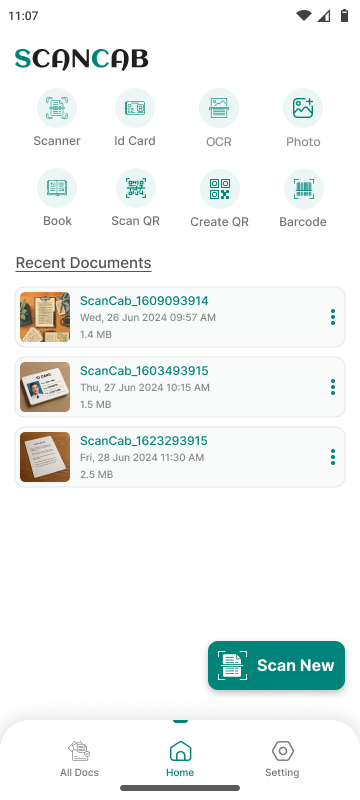
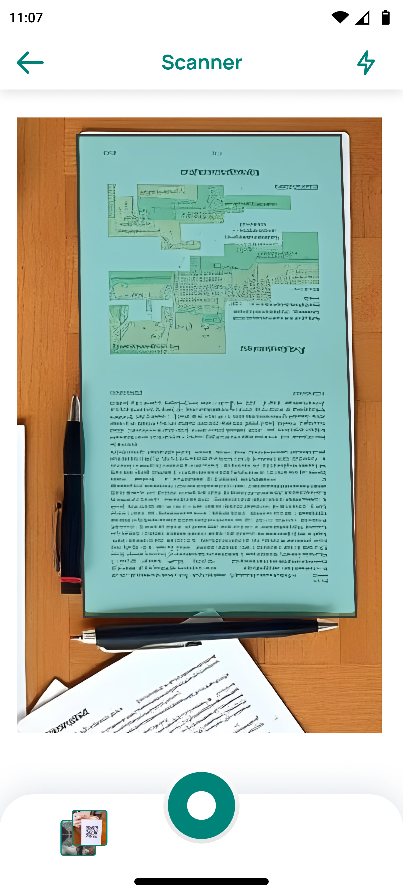
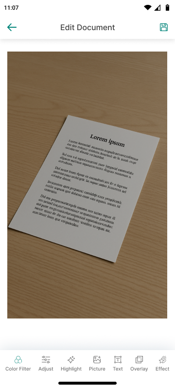
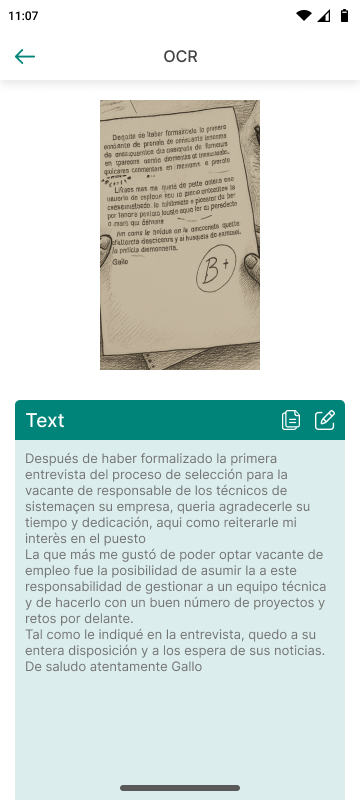

</div>

---

## 📌 Table of Contents

- [About](#-about)
- [What's New](#-whats-new)
- [Features](#-features)
- [Screenshots](#-screenshots)
- [How It Works](#-how-it-works)
- [UI/UX Design](#-uiux-design)
- [Tech Stack](#-tech-stack)
- [Smart Profile](#-smart-profile)
- [Roadmap](#-roadmap)
- [Contact](#-contact)

---

## 📱 About

**ScanCab** is an all-in-one document scanner for Android. Point your camera at a document and ScanCab finds the edges, crops, enhances, and saves it as a clean PDF.

It covers more than plain scanning. ScanCab also reads text with **OCR**, scans and creates **QR codes**, reads **barcodes**, builds print-ready **ID card** copies, converts **photos to PDF**, and includes a **full document editor**.

You can scan receipts, notes, bills, contracts, books, business cards, and ID cards, without a physical scanner.

---

## 🆕 What's New

The latest release adds these features, several of which were previously listed as "future improvements":

| Update | Description |
| --- | --- |
| 🎯 **Auto Edge Detection** | Detects document borders in real time and crops them automatically |
| 🔤 **OCR Text Recognition** | Extracts text from any scan so you can edit and copy it |
| 📊 **Barcode Scanner** | Scans product and retail barcodes with a live scan line |
| 🔳 **QR Scanner & Generator** | Reads QR codes (vCard, URL, text) and creates new ones |
| 🪪 **ID Card Scanner** | Single-side or two-side ID layouts, ready to print |
| 🖼️ **Photo to PDF** | Converts gallery photos into a multi-page PDF |
| ✏️ **Advanced Editor** | Filters, adjust, highlight, add picture, text, overlays, and effects |
| 🗂️ **Smart Categories** | Documents grouped into All Docs, Business Card, ID Card, and Academic |
| 🚫 **Ad-Free Mode** | Watch 3 short ads to use the app ad-free for the rest of the day |

---

## ✨ Features

### 📷 Smart Scanning
- **Auto edge detection**: finds document corners automatically, and you can drag the handles to fine-tune them
- **Flash control** for scanning in low light
- **Multi-page scanning** from the camera or gallery
- **Scan filters**: Original, Magic Color, Grayscale, and B&W
- **Brightness slider**, plus **Retake** and **Rotate** actions

### ✏️ Document Editor
- **Color filters**: Original, Saturize, Mono, Natural, Luv, Soft, and Blurry
- **Adjust**: Brightness, Contrast, Saturation, and Exposure
- **Highlight** with adjustable size, an eraser, and color options
- **Add picture** with an opacity control
- **Add text** with custom font, color, and alignment
- **Overlays and effects** with an intensity slider

### 🔤 OCR: Image to Text
- Extracts text from scanned pages and photos
- Lets you edit the recognized text inline
- Copies text to the clipboard with one tap

### 🔳 QR & Barcode Tools
- **Scan QR** with the camera or from a gallery image, including flashlight support
- Shows results clearly (for example, vCard contact details) with **Share** and **Search** actions
- **Create QR** for Text, E-mail, Phone, SMS, and URL, then **Save** or **Refresh**
- **Barcode scanner** with a focused scan frame

### 🪪 ID Card Scanner
- Choose **Single side** or **Two side** layouts
- Flip vertically or horizontally, rotate left or right, and change colors
- Produces a print-ready ID card copy

### 📂 Smart Document Manager
- **Recent Documents** on the home screen
- **My Documents** with category tabs and **search**
- File details: name, date and time, and file size
- An options menu on each file for quick actions

### 📤 Share & Export
- Export high-quality **PDFs**
- Share instantly by email, WhatsApp, Drive, and more

---

## 📸 Screenshots

### Home & Navigation
| Home | My Documents | Settings | Ad-Free Mode |
| :---: | :---: | :---: | :---: |
|  | 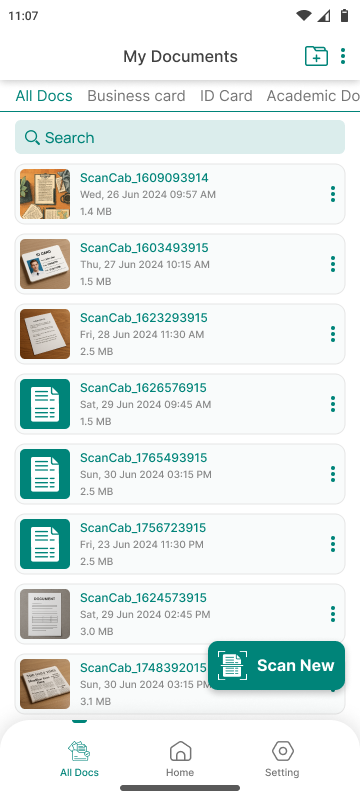 | 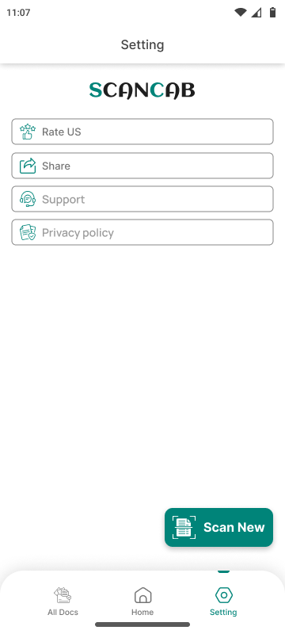 | 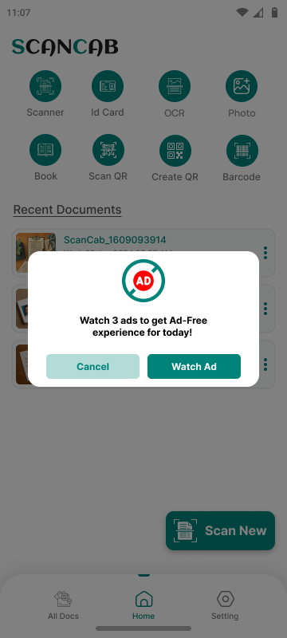 |

### Smart Scanning
| Auto Edge Detection | Crop & Adjust | Scan Filters | Photo to PDF |
| :---: | :---: | :---: | :---: |
|  | 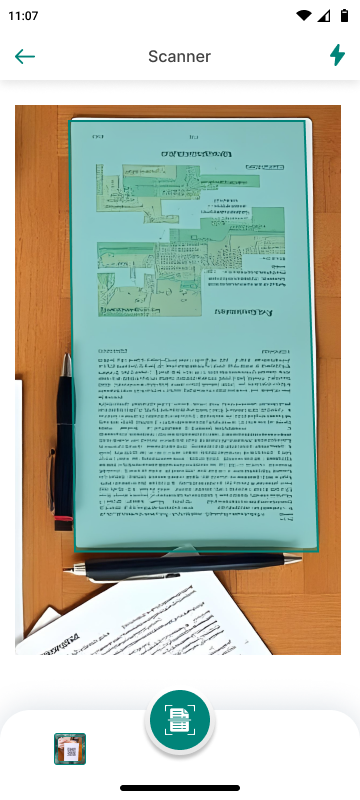 | 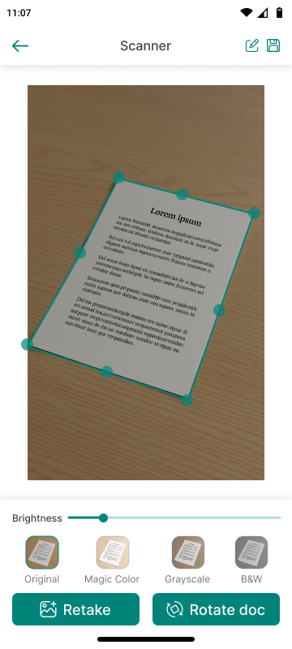 | 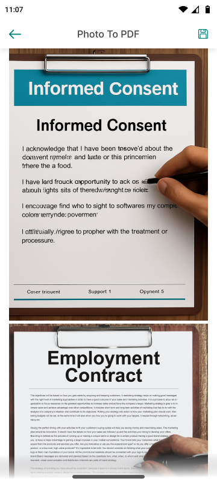 |

### Document Editor
| Editor | Color Filter | Adjust | Highlight |
| :---: | :---: | :---: | :---: |
|  | 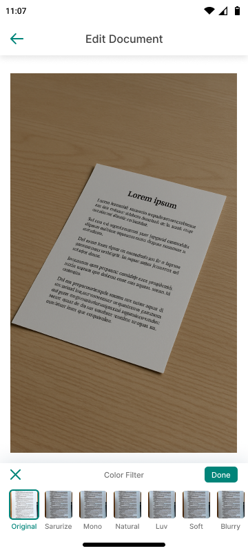 | 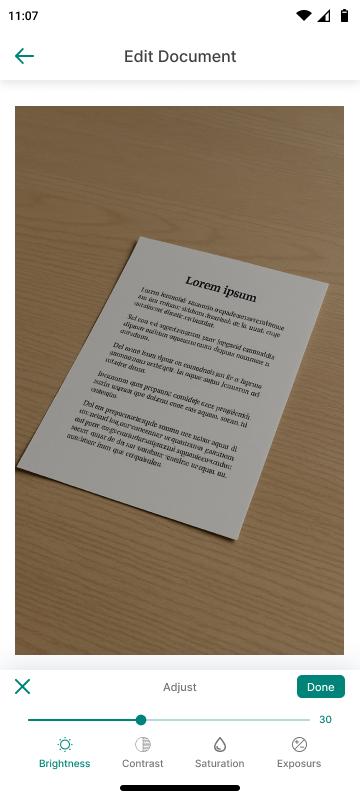 |  |

| Add Picture | Add Text | Overlay | Effect |
| :---: | :---: | :---: | :---: |
| 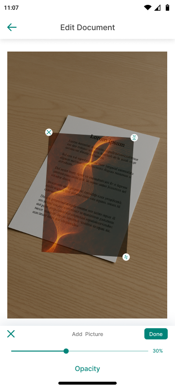 | 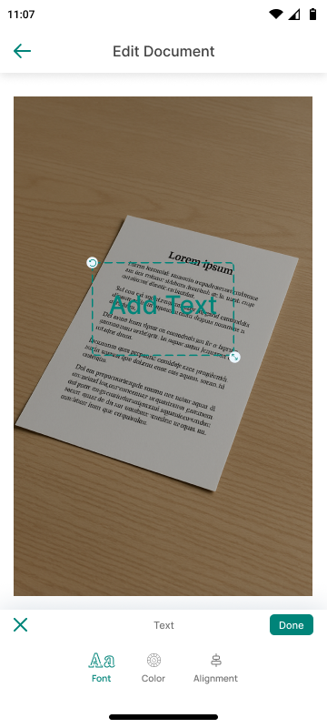 | 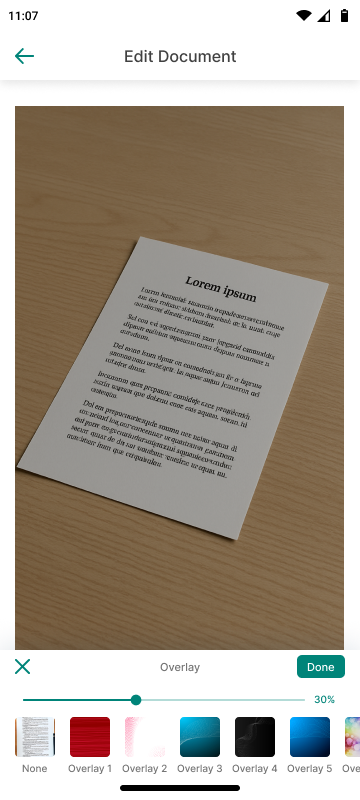 | 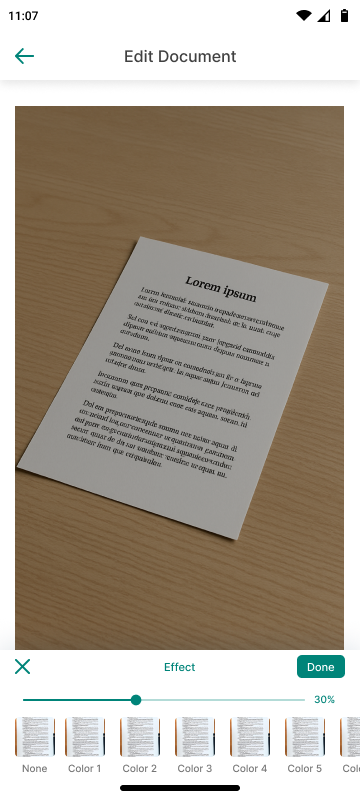 |

### OCR, ID Card, QR & Barcode
| OCR Result | Edit Text | ID Card Mode | ID Card Editor |
| :---: | :---: | :---: | :---: |
|  | 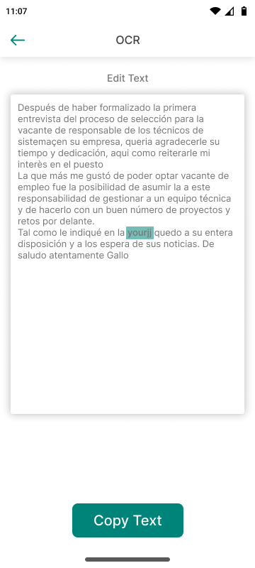 | 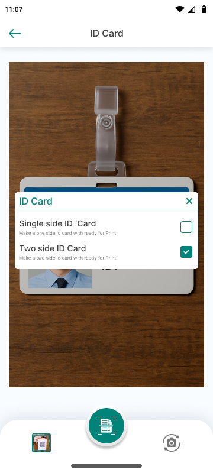 | 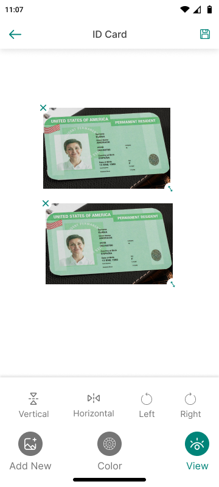 |

| Scan QR | QR Result | Create QR | Barcode |
| :---: | :---: | :---: | :---: |
| 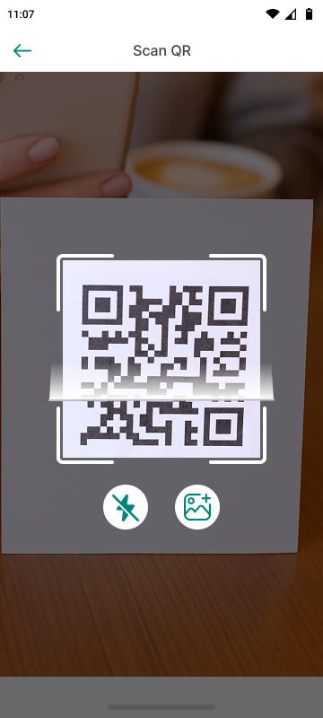 | 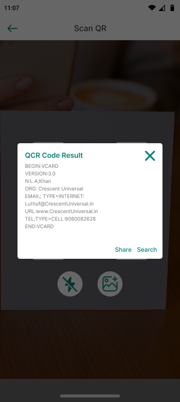 | 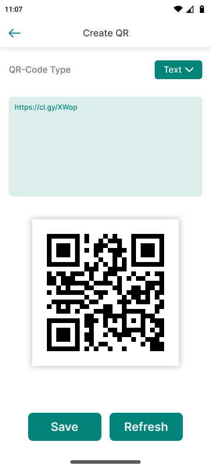 | 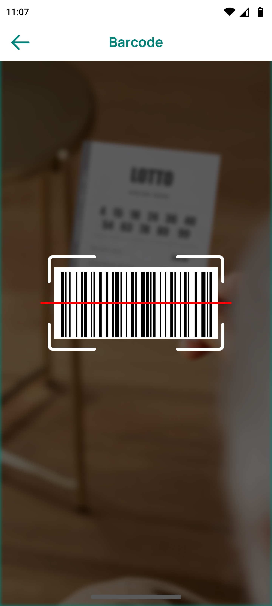 |

---

## ⚙️ How It Works

```
📷 Capture  ──▶  🎯 Auto-detect edges  ──▶  ✂️ Crop & enhance  ──▶  ✏️ Edit / OCR  ──▶  📄 Save as PDF  ──▶  📤 Share
```

1. Tap **Scan New** on the home screen, or pick a tool (Scanner, ID Card, OCR, Photo, Book, Scan QR, Create QR, Barcode).
2. Point the camera at your document. ScanCab detects the edges automatically.
3. Adjust the corners, apply a filter, and rotate if needed.
4. Edit the page, or extract its text with OCR.
5. Save it as a PDF and share it anywhere.

---

## 🎨 UI/UX Design

The whole app was designed in **Figma**, following **Material Design** guidelines.

| Principle | How it is applied |
| --- | --- |
| **Consistent brand color** | A teal primary (`#008479`) for actions, active tabs, and highlights |
| **Tool-first home** | An 8-tool icon grid lets you start any task in one tap |
| **Thumb-friendly layout** | A floating **Scan New** button and a bottom navigation bar (All Docs · Home · Setting) |
| **Focused editing** | Bottom-sheet tool panels with clear **✕ Cancel** and **Done** actions |
| **Live feedback** | Real-time edge overlay, sliders with value labels, and instant filter previews |
| **Clean hierarchy** | White cards, soft shadows, and clear file metadata (date · size) |
| **Accessible** | Large touch targets and icons paired with text labels |

---

## 🛠️ Tech Stack

| Area | Technology |
| --- | --- |
| **Platform** | Android |
| **Language** | Java / Kotlin |
| **UI/UX** | Figma, Material Design |
| **Camera & Detection** | Real-time edge detection and auto-crop |
| **Text Recognition** | OCR engine |
| **Codes** | QR and barcode scanning and generation |
| **Output** | PDF generation and sharing |
| **Storage** | Local storage (cloud optional) |
| **Monetization** | Rewarded ads for ad-free mode |

---

## 👤 Smart Profile

<table>
<tr>
<td width="140" align="center">

</td>
<td>

### Vaidehi Virani
**Android Developer & UI/UX Designer** · Creator of ScanCab

I design and build clean, user-friendly Android apps, from the first Figma wireframe to a live release on Google Play.

- 🎨 **Design:** Figma, Material Design, wireframing, prototyping, design systems
- 📱 **Development:** Android (Java / Kotlin), camera and scanning features, PDF tools
- 🚀 **Shipped:** ScanCab, available on [Google Play](https://play.google.com/store/apps/details?id=com.scan.scancab&pcampaignid=web_share)
- 📫 **Contact:** [loveloop9055@gmail.com](mailto:loveloop9055@gmail.com)

</td>
</tr>
</table>

### 🤝 Team

| Member | Role |
| --- | --- |
| **Vaidehi Virani** | Android Developer & UI/UX Designer (Lead) |
| **Bhavin Mulani** | Team Member |
| **Parth Kothiya** | Team Member |
| **Sagar Sorathiya** | Team Member |

> 💡 A standalone version of this profile is in [`PROFILE.md`](PROFILE.md). You can copy it into your GitHub profile README (`vaidehi9055/vaidehi9055`).

---

## 🎯 Perfect For

🎓 Students · 💼 Professionals · 🏢 Office Workers · 🧑‍💼 Business Owners · 🧑‍💻 Freelancers · 👨‍🏫 Teachers

---

## 🔥 Why Choose ScanCab?

- ✅ Auto edge detection for precise, one-tap scans
- ✅ OCR to turn images into editable text
- ✅ QR, barcode, and ID card tools in one app
- ✅ A powerful built-in document editor
- ✅ High-quality PDF export and instant sharing
- ✅ A clean, modern, easy-to-use interface

---

## 🚀 Roadmap

- [x] Auto edge detection
- [x] OCR text recognition
- [x] Multi-page scanning and Photo to PDF
- [x] QR and barcode scanner and QR generator
- [x] ID card scanner
- [x] Document editor (filters, text, highlight, overlays)
- [ ] Cloud backup and sync
- [ ] Full PDF editing (merge, split, reorder pages)
- [ ] PDF password protection
- [ ] E-signature
- [ ] Dark mode
- [ ] Multi-language OCR

---

## 📫 Contact

📧 **Email:** [loveloop9055@gmail.com](mailto:loveloop9055@gmail.com)
📥 **Download:** [ScanCab on Google Play](https://play.google.com/store/apps/details?id=com.scan.scancab&pcampaignid=web_share)

---

<div align="center">

### ⭐ If you like ScanCab, please give this repository a star!

Made with ❤️ by **Vaidehi Virani** and team

</div>
